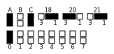
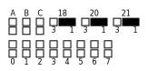
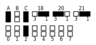

# 23xx Adapter

# Introduction

This is a rework of the excellent design made by Jim Brain to replace a 23xx ROM with a standard JEDEC 28 or 32 pin EPROM/EEPROM or Flash ROM. The main difference, this version is 1.9mm smaller in width and more centered on the socket, allowing enough spacing to replace all three roms in a C64 long-board version where Jim's is a little bit too large to install two side by side.

Since 23xx ROMs can be produced with active high or low select lines, the adapter can decode theses signals and select the ROM on the right one. Also the highest address lines not used by the original ROM are available via SMT pads for permanent configuration, or headers to allow bank dynamic bank switching.

# Configuration

The onboard 74HCT138 3-to-8 decoder converts any combination of the 3 possible chip select lines into a single JEDEC standard select line.  If a select line is not needed, that input can be tied to ground via SMT pads on the bottom of the PCB.

|Pad|Position|                                                                      |
|---|--------|----------------------------------------------------------------------|
|18 |1-2     |Line is routed to adress line A11, SMT Pad A should be solder close   |
|18 |2-3     |Line is used as chip select, A11 can be drive by the SMT Pad or header|
|20 |1-2     |Line is routed to OE    |
|20 |2-3     |Line is used as chip select                                           |
|21 |1-2     |Line is routed to adress line A12, SMT Pad C should be solder close   |
|20 |2-3     |Line is used as chip select, A12 can be drive by the SMT Pad or header|

Once configured, the following truth table show all the possible output at SMT Pads 0-7, solder the pad that is low when the original chip is selected.

|18|20|21|0|1|2|3|4|5|6|7|
|--|--|--|-|-|-|-|-|-|-|-|
|L |L |L |L|H|H|H|H|H|H|H|
|H |L |L |H|L|H|H|H|H|H|H|
|L |H |L |H|H|L|H|H|H|H|H|
|H |H |L |H|H|H|L|H|H|H|H|
|L |L |H |H|H|H|H|L|H|H|H|
|H |L |H |H|H|H|H|H|L|H|H|
|L |H |H |H|H|H|H|H|H|L|H|
|H |H |H |H|H|H|H|H|H|H|L|

## Configuration example for common ICs

|IC Model|Notes                        |A|B|C|18 |20 |21 |0|1|2|3|4|5|6|7||
|--------|-----------------------------|:-:|:-:|:-:|:-:|:-:|:-:|:-:|:-:|:-:|:-:|:-:|:-:|:-:|:-:|:-:|
|2316    |!CS1, !CS2, CS3              | | | |2-3|2-3|2-3| | | | |X| | | ||
|2716    |!EP, !G, Vpp                 | | | |2-3|2-3|2-3| | | | |X| | | ||
|2332    |!CS1, CS2                    |X| | |1-2|2-3|2-3| | | | |X| | | ||
|2364    |!CS1                         |X| |X|1-2|2-3|1-2|X| | | | | | | ||
|2364    |!CS1 (Alt, no 74LS138 decoding)| | | |1-2|1-2|1-2| | | | | | | | ||
|2364    |CS1                          |X| |X|1-2|2-3|1-2| | |X| | | | | ||

## Notes if using EEPROM
Do not forget to pull-up the WE pin or you risk overwriting your EEPROM. As example if using a 28C64/256, solder pad A14, or for 28C512/010/040, solder pad A18.

## Rom banking

Depending on the size of the original and replacement rom, address lines 11 to 18 are available for bank switching, eiter by solder pads or using the 1.27mm header as shown in the pictures below.

|Solder Pads|1.27mm Header|
|:---------:|:-----------:|
|||

# Components and assembly

[Gerbers files](Gerbers/) and SMD assembly files are available for uploading to your prefered manufacturer (I personnally use JLCPCB).  The PCB use SMT parts, except for the headers) while the control board use through-hole components. Refer to the [Bill of Materials](23xx_Adapter_Bom.xlsx) Excel sheet for a complete list of needed components.

# Licence

This work is licensed under the Creative Commons Attribution-NonCommercial-ShareAlike 4.0 International License. To view a copy of this license, visit http://creativecommons.org/licenses/by-nc-sa/4.0/ or send a letter to Creative Commons, PO Box 1866, Mountain View, CA 94042, USA.

# Revision History

|Revision  |Description                    |
|:--------:|-------------------------------|
|1.0       |Initial prototype              |
|2.0       |Add bank switching header      |
